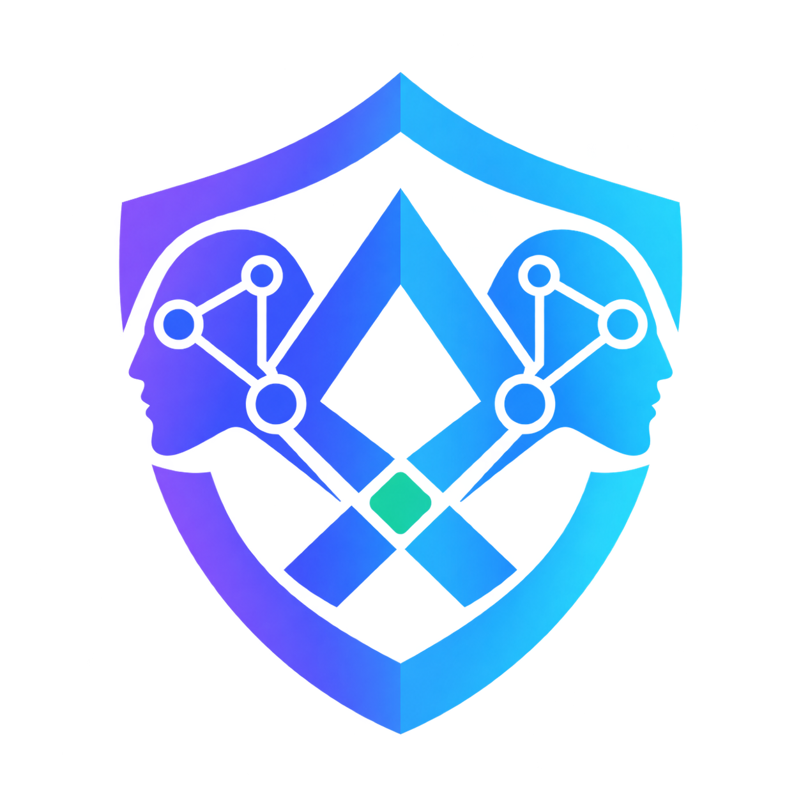
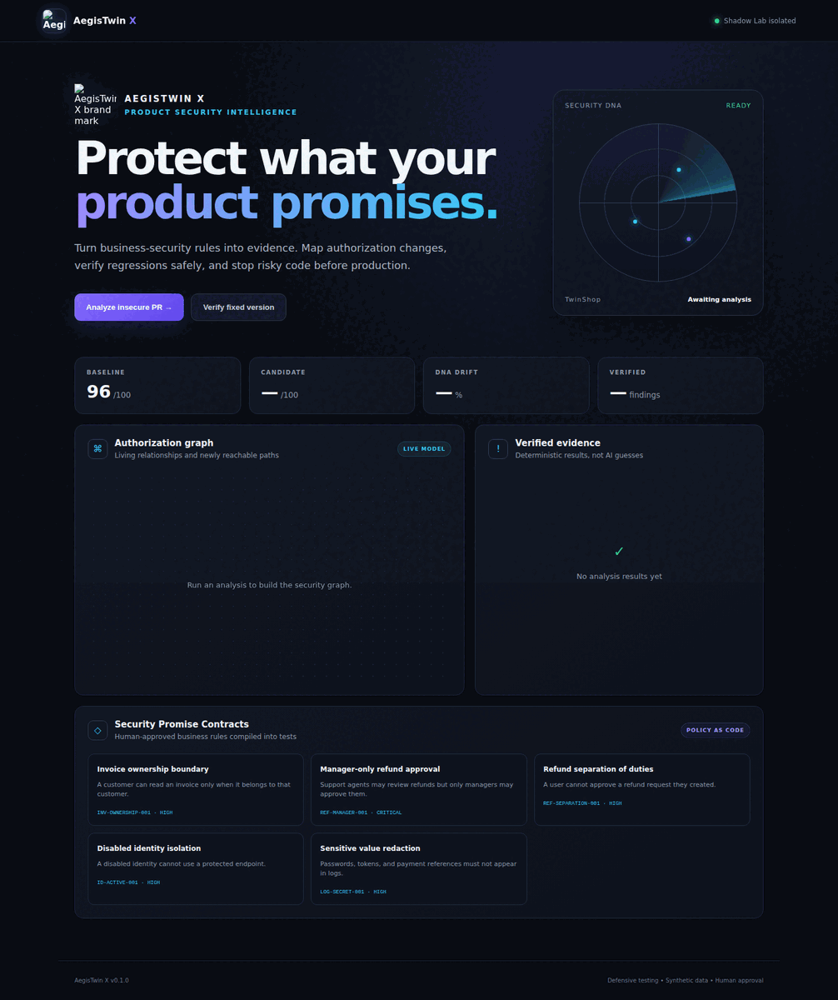
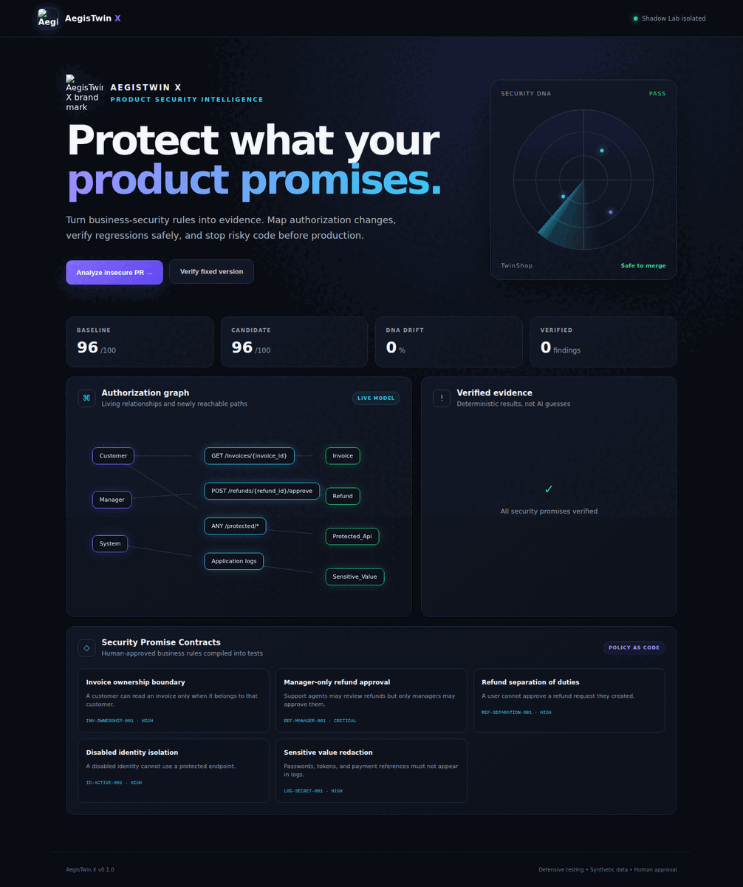
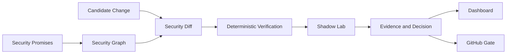

# AegisTwin X

<p align="center">
  
</p>

**AI-assisted Product Security intelligence with deterministic evidence.**

AegisTwin X turns product-specific security promises into executable checks, models authorization relationships, compares a secure baseline with a candidate change, and verifies suspected business-logic regressions against the isolated TwinShop lab.

The CI pipeline runs both the Python test suite and a hardened-container smoke test. It builds the Docker image, starts it with a read-only filesystem and dropped Linux capabilities, checks `/health`, and confirms that the insecure demonstration returns a verified `BLOCK` decision.

> Traditional scanners ask whether code contains a known vulnerability. AegisTwin X asks whether the product still keeps its security promises.

## Product screenshots

### Product Security dashboard



### Verified insecure pull request


### Fixed candidate verification



## What the demo proves

The included insecure candidate introduces two deliberate regressions:

1. A customer can access another customer's invoice.
2. A support agent can approve a manager-only refund.

AegisTwin X detects the changed authorization relationships, verifies both behaviors, builds an evidence-backed report, calculates Security DNA drift, and returns a `BLOCK` decision. The fixed candidate returns `PASS`.

## Architecture



## Quick start

### Docker

```bash
docker compose up --build
```

Open `http://localhost:8000`.

### Local Python

```bash
python -m venv .venv
source .venv/bin/activate
pip install -e ".[dev]"
uvicorn aegistwin.main:app --reload
```

## Verify the project

```bash
pytest -q
python scripts/security_gate.py --variant secure
```

To demonstrate the blocked regression (this command intentionally exits with status 1):

```bash
python scripts/security_gate.py --variant insecure --output insecure-report.md
```

## Security Promise example

```yaml
id: INV-OWNERSHIP-001
subject_role: customer
action: read
resource: invoice
condition: resource.owner_id == subject.user_id
expected_on_failure: 403
severity: high
```

## API

- `GET /health` — service health
- `GET /api/promises` — approved security promises
- `POST /api/analyses/demo?variant=insecure` — run the blocked demo
- `POST /api/analyses/demo?variant=secure` — verify the fixed version
- `GET /api/analyses` — analysis history
- `POST /api/mutations/demo` — evaluate safe control mutations in TwinShop
- `GET /docs` — interactive OpenAPI documentation

## Safety boundary

This repository is intentionally limited to defensive testing with synthetic data inside the included lab. It does not scan public targets, use production credentials, or autonomously merge AI-generated changes.

## Technology

FastAPI, Pydantic, NetworkX, SQLite, PyYAML, Docker, Pytest, GitHub Actions, HTML/CSS/JavaScript.

## Status

Portfolio MVP. Planned extensions include LangGraph-assisted policy drafting, Neo4j-backed multi-service graphs, a VS Code extension, and approved remediation pull requests.

## Author

Sarah Haroun Waswas — Computer and Network Security Engineering.
